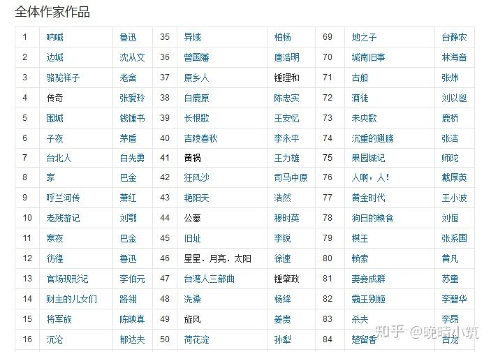

# 2019始记录读书痕迹

## 在读
- <战天京 晚清军政传信录> - 谭伯牛
- <高效能人士的七个习惯> - 史蒂芬*柯维

## 想读
- 设计心理学 2 3 4 - Donald Arthur Norman

- 文学类
    - 瓦尔登湖
    - 尤利西斯
    - 日本文学:
        - ①战前
            - A.无产
                - （左翼）小林多喜二 《蟹工船》叶山嘉树 长篇《生活在海上的人们》短篇《水泥桶里的一封信》
                - 黑岛传治 短篇《盘旋的鸦群》《两分硬币》《猪群》，长篇《武装的市街》
            - B.新感觉
                - 横光利一 长篇《上海》短篇《春天乘着马车来》《神马》《头与腹》
                - 川端康成 《雪国》
        - ②战中
            - 永井荷风《濹东绮谭》《美国故事》《法国故事》
            - 志贺直哉 《暗夜行路》
        - ③战后
            - 太宰治《人间失格》《斜阳》《奔跑吧！梅洛斯》短篇《女学生》
            - 三岛由纪夫《假面的告白》《金阁寺》《丰饶之海》川端康成《千羽鹤》《山之音》《沉睡的美女》《古都》

- 百本华文作品:
    
    

    
### 已读
技术书籍:
- [<关于MySQL, 你必知道的>](https://mp.weixin.qq.com/s/pWHCieOwAdCrz8cauduWlQ)
    - 非常推荐, 作者深入浅出的介绍了MySQL的核心原理
-

# 2018始记录读书痕迹

## 2018

### 正在读
- Openstack 设计与实现

### 准备读

### 已读过
设计类:
- 设计心理学 1

技术类:
- CEPH 设计愿意与实现
- CEPH 源码分析
- Rework

非技术类:
- 家为什么会伤人 - 武志红
- 每一种孤独都有陪伴 - 武志红
- 大国宪制(历史中国的构成) - 苏立
- 红与黑 - 司汤达
- 风起陇西 -
